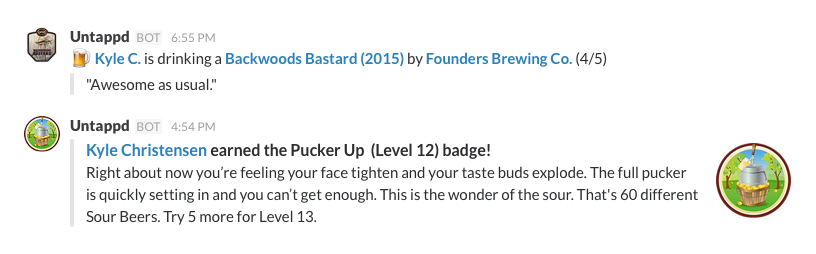

# slappd

### About
Since Untappd does not currently support callbacks or webhooks, I wrote a basic
Slack integration that will relay check-ins and badges earned for specified users
on your feed to a Slack channel.

This script is designed to be run from crontab, and issues one API call per run.

### Known Issues
* The first time you run the script, it may be a little chatty because it has not
previously seen your feed before.
* If you have a lot of Untappd friends, but are only watching a subset of them,
you may miss check-ins if you don't run Slappd regularly.

### Requirements
* Python 3.5
* Some Python modules (configparser, simplejson, requests)
* A way of periodically running this script (at, cron, etc)
* Untappd [API access](https://untappd.com/api/register?register=new)
* A Slack channel full of beer lovers

### Configuration
* Install the required Python modules via: `pip3 install -r requirements.txt`
* Copy [slappd.cfg.dist](slappd.cfg.dist) to 'slappd.cfg' and edit it to reflect your API information
* Run it from crontab: `*/5 * * * python3.5 /path/to/slappd.py > /dev/null 2>&1`
